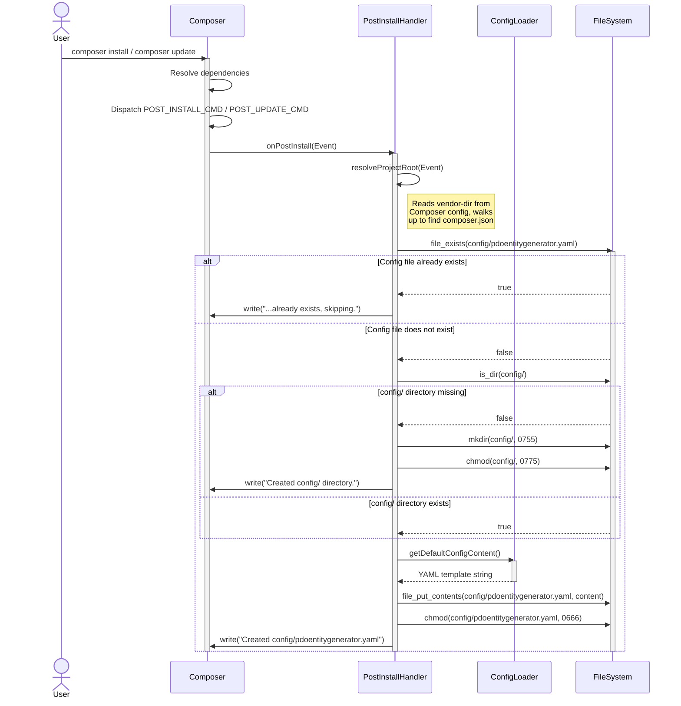
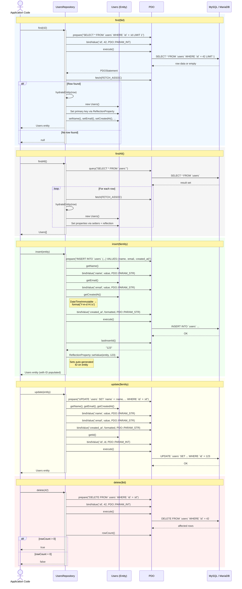

# PDO Entity Generator — Sequence Diagrams

> Comprehensive sequence diagrams covering the two primary user flows: Composer Plugin installation and CLI code generation.

---

## 1. Composer Plugin — Auto-Configuration on Install

This flow is triggered automatically when a user runs `composer install` or `composer update` in a project that includes `kdevhubin/pdoentitygenerator`.

---

## 2. CLI Generation — Primary User Flow

This is the main user flow triggered when the developer runs the CLI command to generate Entity and Repository classes from a database table.

```mermaid
sequenceDiagram
    actor User
    participant CLI as bin/pdoentitygenerator
    participant Command as GenerateEntityCommand
    participant ConfigLoader
    participant YAML as Symfony\Yaml
    participant PDO
    participant Database as MySQL / MariaDB
    participant TableInspector
    participant EntityGen as EntityGenerator
    participant RepoGen as RepositoryGenerator
    participant FileSystem

    User->>CLI: vendor/bin/pdoentitygenerator table users
    activate CLI

    CLI->>CLI: Resolve Composer autoloader
    Note right of CLI: Checks ../../../autoload.php<br/>then ../vendor/autoload.php

    alt Autoloader not found
        CLI-->>User: STDERR: "Autoloader not found"
        CLI-->>User: exit(1)
    end

    CLI->>Command: new GenerateEntityCommand()
    CLI->>Command: run($argv)
    activate Command

    %% === Argument Parsing ===
    Command->>Command: Parse $argv
    Note right of Command: argv[1] = "table"<br/>argv[2] = "users"

    alt --help flag present or argc < 3
        Command-->>User: STDOUT: usage text
        Command-->>CLI: return 0 or 1
    end

    alt Unknown command (argv[1] !== "table")
        Command-->>User: STDERR: "Unknown command"
        Command-->>CLI: return 1
    end

    alt Empty table name
        Command-->>User: STDERR: "Table name is required"
        Command-->>CLI: return 1
    end

    %% === Execute Pipeline ===
    Command->>Command: execute("users")

    %% --- Project Root Resolution ---
    Command->>Command: resolveProjectRoot()
    Note right of Command: Walks up from getcwd()<br/>until composer.json found
    Command-->>User: STDOUT: "Project root: /path/to/project"

    %% --- Configuration Loading ---
    Command->>ConfigLoader: new ConfigLoader()
    Command->>ConfigLoader: load(projectRoot)
    activate ConfigLoader

    ConfigLoader->>FileSystem: file_exists(config/pdoentitygenerator.yaml)
    activate FileSystem

    alt Config file missing
        FileSystem-->>ConfigLoader: false
        ConfigLoader-->>Command: throw RuntimeException
        Command-->>User: STDERR: "Configuration file not found"
        Command-->>CLI: return 1
    end

    FileSystem-->>ConfigLoader: true
    deactivate FileSystem

    ConfigLoader->>YAML: Yaml::parseFile(configFile)
    activate YAML
    YAML-->>ConfigLoader: parsed array
    deactivate YAML

    alt Invalid YAML (not an array)
        ConfigLoader-->>Command: throw RuntimeException
    end

    ConfigLoader->>ConfigLoader: mergeWithDefaults(parsed)
    Note right of ConfigLoader: Deep-merge with DEFAULTS<br/>Cast port to int<br/>Validate dbname non-empty

    alt dbname is empty
        ConfigLoader-->>Command: throw RuntimeException
    end

    ConfigLoader-->>Command: validated config array
    deactivate ConfigLoader

    Command-->>User: STDOUT: "Database: my_database"

    %% --- PDO Connection ---
    Command->>Command: createPdoConnection(config['database'])
    Command->>PDO: new PDO(dsn, username, password, attributes)
    activate PDO
    Note right of PDO: ERRMODE_EXCEPTION<br/>FETCH_ASSOC<br/>EMULATE_PREPARES = false

    alt Connection failure
        PDO-->>Command: throw PDOException
        Command-->>Command: wrap as RuntimeException
        Command-->>User: STDERR: "Database connection failed"
        Command-->>CLI: return 1
    end

    PDO-->>Command: PDO instance
    deactivate PDO
    Command-->>User: STDOUT: "Connected to database."

    %% --- Table Inspection ---
    Command->>TableInspector: new TableInspector(pdo)
    Command->>TableInspector: inspect("users")
    activate TableInspector

    TableInspector->>TableInspector: quoteIdentifier("users")
    Note right of TableInspector: Wraps in backticks,<br/>escapes embedded backticks

    TableInspector->>PDO: prepare("DESCRIBE `users`")
    PDO->>Database: DESCRIBE `users`
    activate Database
    Database-->>PDO: result set (Field, Type, Null, Key, Default, Extra)
    deactivate Database
    PDO-->>TableInspector: PDOStatement

    TableInspector->>TableInspector: fetchAll(FETCH_ASSOC)

    alt Table not found or empty
        TableInspector-->>Command: throw RuntimeException
    end

    loop For each column row
        TableInspector->>TableInspector: resolvePhpType(row['Type'])
        Note right of TableInspector: 1. Exact match in TYPE_MAP<br/>2. Strip size/precision → base type<br/>3. Strip unsigned/zerofill<br/>4. Fallback to 'string'
    end

    TableInspector-->>Command: columns[] {name, phpType, nullable, isPrimary, hasDefault}
    deactivate TableInspector

    Command-->>User: STDOUT: "Found N column(s) in table 'users'."

    %% --- Class Name Derivation ---
    Command->>EntityGen: snakeToPascalCase("users")
    EntityGen-->>Command: "Users"

    %% === Entity Generation ===
    Command->>EntityGen: new EntityGenerator()
    Command->>EntityGen: generate("Users", entityNamespace, columns)
    activate EntityGen

    loop For each column
        EntityGen->>EntityGen: snakeToCamelCase(column.name)
        EntityGen->>EntityGen: resolveDefaultValue(column)
        Note right of EntityGen: Primary/nullable → null<br/>string → ''<br/>int → 0<br/>float → 0.0<br/>bool → false

        EntityGen->>EntityGen: buildGetter(propertyName, typeHint)

        alt Not primary key
            EntityGen->>EntityGen: buildSetter(propertyName, typeHint, className)
            Note right of EntityGen: Fluent setter returning self
        end
    end

    EntityGen->>EntityGen: buildClassTemplate(className, namespace, properties, gettersSetters)
    EntityGen->>EntityGen: normaliseIndentation(gettersSetters)
    Note right of EntityGen: Converts 12-space heredoc<br/>indent to 4-space standard

    EntityGen-->>Command: Entity PHP source code
    deactivate EntityGen

    %% === Repository Generation ===
    Command->>RepoGen: new RepositoryGenerator()
    Command->>RepoGen: generate("Users", entityNS, repoNS, "users", columns)
    activate RepoGen

    RepoGen->>RepoGen: findPrimaryKey(columns)
    Note right of RepoGen: Scans for isPrimary === true<br/>Defaults to 'id'

    RepoGen->>RepoGen: Filter non-primary columns

    %% --- Hydrate Method ---
    RepoGen->>RepoGen: buildHydrateBody("Users", columns)
    loop For each column
        RepoGen->>EntityGen: snakeToCamelCase(column.name)
        Note right of RepoGen: Type-cast mapping:<br/>int → (int)<br/>float → (float)<br/>bool → (bool)<br/>DateTimeImmutable → new DTI()<br/>default → (string)

        alt Primary key column
            Note right of RepoGen: Set via ReflectionProperty
        else Non-primary column
            Note right of RepoGen: Set via setter method
        end
    end

    %% --- Insert Method ---
    RepoGen->>RepoGen: buildInsertMethod("Users", "users", primaryKey, nonPrimaryColumns)
    loop For each non-primary column
        RepoGen->>EntityGen: snakeToCamelCase(column.name)
        RepoGen->>RepoGen: buildBindValueLine(colName, getter, column)
        RepoGen->>RepoGen: resolvePdoParamType(column.phpType)
        Note right of RepoGen: int → PARAM_INT<br/>bool → PARAM_BOOL<br/>default → PARAM_STR

        alt Nullable column
            Note right of RepoGen: Local variable +<br/>ternary for PARAM_NULL
        end
    end

    %% --- Update Method ---
    RepoGen->>RepoGen: buildUpdateMethod("Users", "users", pk, nonPrimary, allColumns)
    Note right of RepoGen: Same bindValue pattern<br/>+ primary key binding

    %% --- Inline Methods ---
    RepoGen->>RepoGen: getColumnPhpType(primaryKey, columns)
    RepoGen->>RepoGen: resolvePdoParamType(primaryPhpType)
    Note right of RepoGen: find() and delete() use<br/>bindValue for primary key

    RepoGen->>RepoGen: Assemble class template via heredoc
    Note right of RepoGen: __construct(PDO),<br/>find(), findAll(),<br/>insert(), update(),<br/>delete(), hydrateEntity()

    RepoGen-->>Command: Repository PHP source code
    deactivate RepoGen

    %% === File Writing ===
    Command->>FileSystem: writeFile(root, entityDir, "Users.php", entityCode)
    activate FileSystem

    alt Entity directory does not exist
        FileSystem->>FileSystem: mkdir(entityDir, 0755)
        FileSystem->>FileSystem: chmod(entityDir, 0775)
    end

    FileSystem->>FileSystem: file_put_contents("Users.php", code)
    FileSystem->>FileSystem: chmod("Users.php", 0664)
    deactivate FileSystem
    Command-->>User: STDOUT: "Created: src/Entity/Users.php"

    Command->>FileSystem: writeFile(root, repoDir, "UsersRepository.php", repoCode)
    activate FileSystem

    alt Repository directory does not exist
        FileSystem->>FileSystem: mkdir(repoDir, 0755)
        FileSystem->>FileSystem: chmod(repoDir, 0775)
    end

    FileSystem->>FileSystem: file_put_contents("UsersRepository.php", code)
    FileSystem->>FileSystem: chmod("UsersRepository.php", 0664)
    deactivate FileSystem
    Command-->>User: STDOUT: "Created: src/Repository/UsersRepository.php"

    Command-->>User: STDOUT: "Generation complete!"
    Command-->>CLI: return 0
    deactivate Command

    CLI-->>User: exit(0)
    deactivate CLI
```

---

## 3. Generated Repository — Runtime CRUD Interactions

This diagram shows how the **generated** repository class interacts with the database at runtime, after the code has been generated.

---

## Participants Summary

| Participant | Class / Component | Role |
|-------------|-------------------|------|
| **User** | Developer | Triggers Composer install or CLI command |
| **Composer** | Composer 2.x | Dispatches lifecycle events |
| **CLI** | `bin/pdoentitygenerator` | Entry point — resolves autoloader, delegates to command |
| **Command** | `GenerateEntityCommand` | Orchestrates the full generation pipeline |
| **ConfigLoader** | `ConfigLoader` | Reads and validates YAML configuration |
| **YAML** | `Symfony\Component\Yaml\Yaml` | Parses YAML files |
| **PDO** | `\PDO` | Database connection and prepared statements |
| **Database** | MySQL / MariaDB | Source of table schema and runtime data |
| **TableInspector** | `TableInspector` | Inspects table schema via `DESCRIBE` |
| **EntityGen** | `EntityGenerator` | Generates Entity class source code |
| **RepoGen** | `RepositoryGenerator` | Generates Repository class source code |
| **PostInstallHandler** | `PostInstallHandler` | Composer Plugin — auto-creates config file |
| **FileSystem** | PHP filesystem functions | Directory creation and file writing |
| **Repo** | Generated `*Repository` | Runtime CRUD operations (generated output) |
| **Entity** | Generated Entity class | Runtime data object (generated output) |
